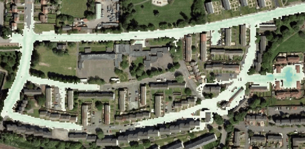

# Itzï 🌊

[](https://github.com/ItziModel/itzi/actions/workflows/tests.yml)
[](https://badge.fury.io/py/itzi)
[](https://itzi.readthedocs.io/en/latest/?badge=latest)

**Effortless flood modeling with seamless GIS integration**

Itzï is a powerful, open-source hydrologic and hydraulic modeling platform that makes flood simulation accessible to everyone.
Built with GRASS GIS integration at its core, Itzï eliminates the complexity of traditional flood modeling workflows, allowing you to focus on what matters most: understanding and predicting water flow patterns.



## 🚀 Why Choose Itzï?

**🎯 GIS-Native Design**
- **No data wrestling**: Work directly with your existing GIS data
- **Resolution flexibility**: Change model resolution with a single command, no matter the resolution of your input data
- **Seamless workflow**: From data preparation to results visualization, all within your familiar GIS environment

**⚡ Advanced Capabilities**
- **2D surface flow modeling** with a damped partial inertia numerical scheme
- **Drainage inflow and overflow** with integrated SWMM coupling
- **Space-time variability of inputs**: Easily model rainfall fields from weather radar or satellite data 📡

**🔧 User-Friendly**
- **Simple configuration**: Text-based parameter file
- **Flexible boundaries**: Easy setup of inflows, outflows, and boundary conditions
- **Rich outputs**: Generate animations, time series, and detailed flood maps

## 📦 Quick Installation

### Prerequisites
Itzï requires [GRASS GIS 8.4 or above](https://grass.osgeo.org/download/). Install GRASS first, then proceed with Itzï installation.

### Recommended Installation (using uv)
We recommend using [uv](https://docs.astral.sh/uv) for the best installation experience:

```bash
# Install uv (if not already installed)
curl -LsSf https://astral.sh/uv/install.sh | sh

# Install Itzï
uv tool install itzi

# Verify installation
itzi version
itzi run -h
```

### Alternative Installation Methods
```bash
# Using pip
pip install itzi

# Using pipx
pipx install itzi
```

### Updating
```bash
# Update to latest version
uv tool update itzi
```

## 🎯 Quick Start

1. **Prepare your data** in GRASS (DEM, rainfall, friction data)
2. **Create a parameter file** defining your simulation setup
3. **Run the simulation**: `itzi run your_config.ini`
4. **Visualize and analyze results** using GRASS tools, or export for external analysis

Check out our [comprehensive tutorial](https://itzi.rtfd.io/en/latest/tutorial.html) for a step-by-step walkthrough using real-world data.

## 🌟 Key Features

- **Dynamic 2D Surface Flow**: Simulate complex surface water movement on regular grids
- **Drainage network integration**: Model culverts, storm drains, and urban drainage infrastructure with SWMM
- **Map time series as input and output**: Generate detailed spatiotemporal analysis of flood events
- **Mass balance monitoring**: Automatic detection of instabilities, no more garbage output
- **Hydrology**: Space-time rainfall and Green-Ampt infiltration
- **Cross-platform**: Runs on Linux, Windows, and macOS

## 📚 Documentation & Support

- **📖 Documentation**: [itzi.readthedocs.io](https://itzi.rtfd.io/)
- **🌐 Website**: [itzi.org](https://www.itzi.org/)
- **💻 Source Code**: [GitHub Repository](https://github.com/ItziModel/itzi)
- **🐛 Issues**: [Report bugs or request features](https://github.com/ItziModel/itzi/issues)

## 📄 Citation

If you use Itzï in your research, please cite:

> Courty, L. G., Pedrozo-Acuña, A., & Bates, P. D. (2017).
> Itzï (version 17.1): an open-source, distributed GIS model for dynamic flood simulation.
> *Geoscientific Model Development*, 10(4), 1835–1847.
> https://doi.org/10.5194/gmd-10-1835-2017

## 🤝 Contributing

We welcome contributions from the community! Whether you're fixing bugs, adding features, or improving documentation, your help makes Itzï better for everyone.

- **Contributing Guide**: See [CONTRIBUTING.md](CONTRIBUTING.md)
- **Code of Conduct**: See [CODE_OF_CONDUCT.md](CODE_OF_CONDUCT.md)

## 📜 License

Itzï is released under the GPL license. See [LICENSE](LICENSE) for details.

---

*Ready to model floods with ease? [Get started with our tutorial](https://itzi.rtfd.io/en/latest/tutorial.html) and join the growing community of Itzï users worldwide!*
