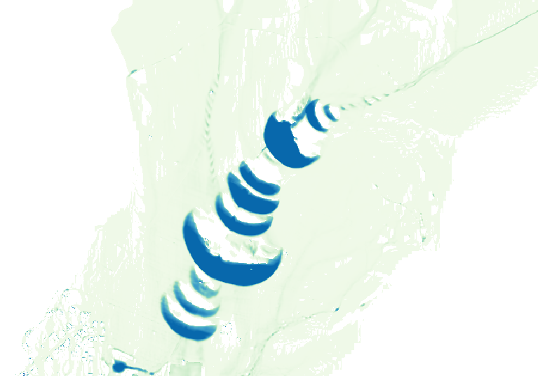

Frequently Asked Questions
==========================

Controlling numerical instabilities
-----------------------------------

In some cases, runaway instabilities could occur, creating wave-like surface flow:

There are two ways to control them.
The first one and the more effective is by reducing the time-step,
which could be achieved by changing two options:

-  *cfl* that applies to every calculated time-step
-  *dtmax* that defines a maximum value for the time-step

The second one is by reducing the *theta* option.
Please note however that a value below 0.7 could be counter-productive.

Performances and computer resources usage
-----------------------------------------

*Itzï* is parallelized using OpenMP.
By default, it will try to use all available hardware threads on the machine.
The number of threads used can be changed by setting the environment variable OMP\_NUM\_THREADS.

Given the type of numerical scheme, using a computer with more cores and
faster RAM will likely decrease the computation time.
No parallel efficiency test has been performed so far, though.
For an example of expected performance, a 24h simulation of urban floods with direct
rainfall on a 5m DEM of 3.5 millions cells takes around 3 hours with an Intel Core i7-4790 (4 cores, 8 threads).

How to decrease computation time
~~~~~~~~~~~~~~~~~~~~~~~~~~~~~~~~

The factors that influence the computation time are:

-  The duration of the simulated event.
-  The number of cells in the domain.
-  The number of wet cells in the domain.
   Direct rainfall is more demanding.
-  The cell size. A smaller cell size decreases the time-step.
-  The maximum water depth in the domain.
   The higher the water, the smaller the time-step.
-  The amount and frequency of result maps. Disk operations being slow
   and not yet parallelized (as of version 17.1), writing more maps to
   the disk will slow the simulation down.

As we can see, they are two main categories of factors.
Those that increase the raw computation load (more cells),
and those that lower the simulation time-step.
For the same study area, increasing the cell size is the more efficient way to make a simulation faster,
because it influence both the number of cells and the time-step.

Memory usage
~~~~~~~~~~~~

On average, *Itzï* 17.1 uses around 250 MB of RAM for each million cells in the domain.
