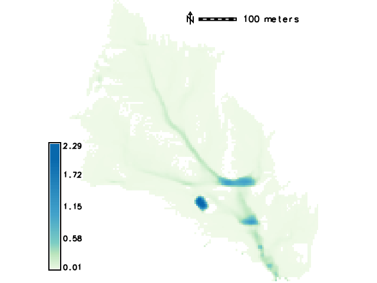
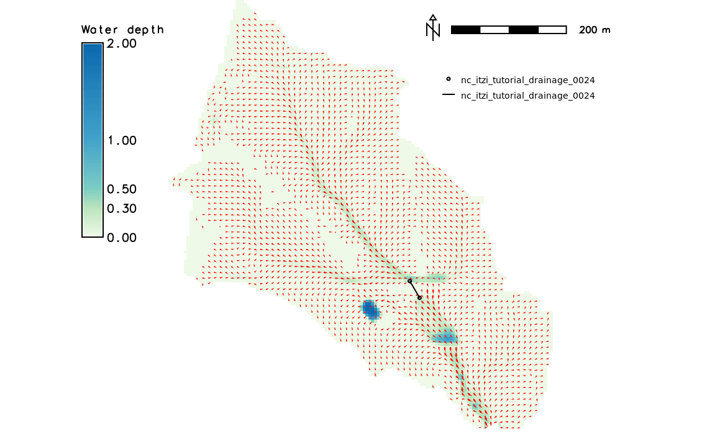

Tutorial
========

This tutorial shows how to run a basic Itzï simulation using freely available dataset.

It assumes that GRASS and Itzï are properly installed on your machine
and that you possess a basic knowledge of GRASS.

Get ready
---------

Here we will use the GRASS `North Carolina dataset <https://grass.osgeo.org/download/data/#NorthCarolinaDataset>`__.
Please download the full dataset and extract it in your *grassdata* directory.
Then start GRASS in the PERMANENT mapset.

Alternatively, you can create a new project using the EPSG:3358 projection,
download only the lidar elevation data from `Zenodo <https://zenodo.org/records/15009114>`__,
and import it using *r.in.gdal*.

Surface modelling
-----------------

Adjust the region
~~~~~~~~~~~~~~~~~

Fit the lidar elevation raster map and set a resolution of 5m:

.. code:: sh

    g.region raster=elev_lid792_1m@PERMANENT res=5

Resample the DEM
~~~~~~~~~~~~~~~~

Please note that this step is not strictly necessary.
The Itzï simulation will be carried out in any case on the defined computational
region extent and resolution.
However the bilinear interpolation smooth the surface,
which prevent high slope values that could occur if using the GRASS default nearest-neighbour sampling.

.. code:: sh

    r.resamp.interp input=elev_lid792_1m@PERMANENT output=elev_lid792_5m

Create a raster mask
~~~~~~~~~~~~~~~~~~~~

Generate a drainage direction map and then create a watershed raster using the outlet point coordinates:

.. code:: sh

    r.watershed elevation=elev_lid792_5m drainage=elev_lid792_5m_drainage
    r.water.outlet input=elev_lid792_5m_drainage output=watershed coordinates=638888,220011

Create a raster mask to prevent calculation outside of the watershed:

.. code:: sh

    r.mask rast=watershed

Create boundary condition maps
~~~~~~~~~~~~~~~~~~~~~~~~~~~~~~

Create a vector map with the watershed outlet point:

.. code:: sh

    echo '638888|220011' > watershed_out.txt
    v.in.ascii input=watershed_out.txt output=watershed_out

Using this vector map, create two raster maps for the boundary conditions.
The first with a value corresponding to the type of condition,
here 4 corresponds to a fixed water depth inside the domain.
The second being the value of the depth wanted, here 0.

.. code:: sh

    v.to.rast input=watershed_out type=point output=bctype use=val value=4
    v.to.rast input=watershed_out type=point output=bcvalue use=val value=0

Create rainfall and friction maps
~~~~~~~~~~~~~~~~~~~~~~~~~~~~~~~~~

Create maps of uniform rainfall and friction coefficient:

.. code:: sh

    r.mapcalc exp='rain=100'
    r.mapcalc exp='n=0.05'

Create a parameters file
~~~~~~~~~~~~~~~~~~~~~~~~

Create a new parameter file and fill it with the ID of the created maps.
It should look like the following:

.. code:: ini

    [time]
    duration = 02:00:00
    record_step = 00:05:00

    [input]
    dem = elev_lid792_5m@PERMANENT
    friction = n@PERMANENT
    rain = rain@PERMANENT
    bctype = bctype@PERMANENT
    bcval = bcvalue@PERMANENT

    [output]
    prefix = nc_itzi_tutorial
    values = water_depth, wse, v, vdir, mean_boundary_flow

    [statistics]
    stats_file = nc_itzi_tutorial.csv

Run the simulation
~~~~~~~~~~~~~~~~~~

Run the simulation:

.. code:: sh

    itzi run <parameter_file_name>

.. versionadded:: 25.7
    Mass balance error detection added.

This should fail with an error like this one:

.. code:: sh

    WARNING: Error during execution: itzi.itzi_error.MassBalanceError: Mass balance error 0.07 exceeds threshold 0.05

This means that some numerical instabilities have been detected, and the simulation automatically stopped.
This prevents the software to run for a long time, only to get bad results at the end.
To solve those instabilities, we should lower the time-step duration.
The easiest way to do it is to lower the time-step multiplier ``cfl`` by adding the option in the ini file, like so:

.. code:: ini

    [options]
    cfl = 0.5

Learn more on this topic in :ref:`numerical-instabilities`.

Now you can run the simulation again, with the ``-o`` flag to overwrite the data fro the previous, failed run:

.. code:: sh

    itzi run -o <parameter_file_name>

Now, the simulation should run until the end.
At the end of the simulation, Itzï should have generated five Space-Time
Raster Dataset (STRDS) in the form:

.. code:: sh

    <prefix>_<variable>

The maps contained in those STDRS are following this naming convention:

.. code:: sh

    <prefix>_<variable>_<order_number>

Here is the example of the map *nc\_itzi\_tutorial\_water_depth\_0020*:

All the results can be processed using the GRASS tools for raster maps and / or space-time dataset.
For instance, it is easy to generate an animation of the results using *g.gui.animation*.

Culvert modelling
-----------------

As you can notice in the image above, the flow accumulates at some points.
One of this accumulation is due to a road that act like a dike and weir.
It is better seen when displaying the streets and flow arrows:

.. image:: /img/nc_itzi_tutorial_arrows_s.png
    :alt: Illustration of road blockage

One option to solve this problem is to model a culvert using the coupled modelling capacity of Itzï.
Itzï is able to run the SWMM drainage model alongside the surface model, and model the interactions between the two.

In the present case, the first step is to decide where the culvert will be located, and annotate:

* The coordinates of the the input and output node,
* the altitude at those points.

Unfortunately, two issues limit the use for the modelling of culvert:

* SWMM needs to have a connected *outfall* node in the network model
* The Itzï coupling code is designed for manhole, not culvert entrance.

We can circumvent those limitations by first, adding an outlet at a higher elevation, linked to the rest of the network by a dummy pipe,
and second, set the coupling surface to a large surface (here we'll set it equal to the cell surface).

SWMM configuration file
~~~~~~~~~~~~~~~~~~~~~~~

The description of the drainage network is done in a classic SWMM configuration file.
More information could be found in the `SWMM user's manual <https://nepis.epa.gov/Exe/ZyPURL.cgi?Dockey=P100N3J6.txt>`__.

.. note:: *START_DATE* and *START_TIME* are not taken into account during a coupled simulation.
          The drainage model always starts and stops at the same time than the surface model.

.. code:: ini

    [TITLE]
    'Wake county culvert'

    [OPTIONS]
    FLOW_UNITS           CMS
    INFILTRATION         HORTON
    FLOW_ROUTING         DYNWAVE
    START_DATE           01/01/0001
    START_TIME           00:00:00
    REPORT_START_DATE    01/01/0001
    REPORT_START_TIME    00:00:00
    END_DATE             01/01/0001
    END_TIME             2:00:00
    SWEEP_START          01/01
    SWEEP_END            12/31
    DRY_DAYS             0
    REPORT_STEP          00:05:00
    WET_STEP             00:00:05
    DRY_STEP             01:00:00
    ROUTING_STEP         2
    ALLOW_PONDING        YES
    INERTIAL_DAMPING     NONE
    VARIABLE_STEP        .5
    LENGTHENING_STEP     0
    MIN_SURFAREA         25
    NORMAL_FLOW_LIMITED  FROUDE
    SKIP_STEADY_STATE    NO
    FORCE_MAIN_EQUATION  D-W
    LINK_OFFSETS         DEPTH
    MIN_SLOPE            0

    [JUNCTIONS]
    ;;        Invert   Max.   Init.  Surcharge  Ponded
    ;;Name    Elev.    Depth  Depth  Depth      Area
    ;;------- -------- ------ ------ ---------- ------
    J0        112      0.0    0      0          0
    J1        111.4    0.0    0      0          0

    [OUTFALLS]
    ;;         Invert    Outfall  Stage/Table    Tide
    ;;Name     Elev.     Type     Time Series    Gate
    ;;-------- --------- -------- -------------- ----
    O2         1000      FREE                    NO

    [COORDINATES]
    ;;Node       X-Coord  Y-Coord
    ;;---------- -------  -------
    J0           638752   220262
    J1           638769   220233

    [CONDUITS]
    ;;       Inlet  Outlet         Manning Inlet  Outlet
    ;;Name   Node   Node    Length N       Offset Offset
    ;;------ ------ ------- ------ ------- ------ ------
    C0       J0     J1      34     0.017   0      0
    C1       J1     O2      100    0.017   0      0

    [XSECTIONS]
    ;;Link    Shape      Geom1 Geom2 Geom3 Geom4 Barrels
    ;;------- ---------- ----- ----- ----- ----- -------
    C0        CIRCULAR   1.5   0     0     0     2
    C1        CIRCULAR   0.1   0     0     0     1

Here, *J0* and *J1* are the input and output nodes of the culvert, and *C0* is the culvert itself.
The latter is made of two pipes of 1.5m of diameter.
The outfall *O2* and the link *C1* are added to comply with the SWMM rule needing them.

Update the Itzï's parameter file
~~~~~~~~~~~~~~~~~~~~~~~~~~~~~~~~

The parameter file of created in the precedent tutorial could be used and adapted by the addition of the *[drainage]* section, like so:

.. code:: ini

    [time]
    duration = 00:50:00
    record_step = 00:05:00

    [input]
    dem = elev_lid792_5m@PERMANENT
    friction = n@PERMANENT
    rain = rain@PERMANENT
    bctype = bctype@PERMANENT
    bcval = bcvalue@PERMANENT

    [output]
    prefix = nc_itzi_tutorial_drainage
    values = water_depth, v, vdir

    [statistics]
    stats_file = nc_itzi_tutorial_drainage.csv

    [drainage]
    swmm_inp = tutorial_drainage.inp
    output = nc_itzi_tutorial_drainage

    [options]
    cfl = 0.5
    theta = 0.9
    dtmax = .5

Where *swmm_inp* is the path to the SWMM configuration file and *output* is the name of the Space-Time Vector Dataset where the drainage data will be written.

Running the simulation
~~~~~~~~~~~~~~~~~~~~~~

The simulation is ran the same way as the previous tutorial.
Itzï will call SWMM that will in turn loads its own configuration file automatically.

The resulting water depth map is shown here:

The area upstream the road is noticeably less flooded, with a maximum water depth coming down from 1.03m without culvert to 0.45m with culvert.
You can use the temporal tools of GRASS to query the evolution in time of the drainage network values.
For example, to get the evolution of the flow leaving the upstream node *J0* of the culvert:

.. code:: sh

    t.vect.db.select input=nc_itzi_tutorial_drainage@itzi_results columns=outflow where="node_id=='J0'"

    start_time|end_time|outflow
    0||0
    300||0.0425260290503502
    600||1.63466286659241
    900||4.20853137969971
    1200||4.59034490585327
    1500||4.64469814300537
    1800||4.6541862487793
    2100||4.6692533493042
    2400||4.65738391876221
    2700||4.66986560821533
    3000||4.66973972320557
